<h1><b>Server setup</b></h1>

This role tested on Ubuntu 20.04.

1) Change inventories, group_vars, host_vars values to your own 
2) Start playbook 

<code>ansible-playbook -i ./inventories/hosts ./strongswan.yml</code>

 
<b>Recommendations</b> 

1) If you need to recreate all certs, delete /etc/ipsec.d/private/ca-key.pem on remote host
and ansible role automaticaly will regenerate all necessary keys at the next start of role.

OR

run ansible-playbook with variable generate_certs=true

<code>ansible-playbook -i ./inventories/hosts ./strongswan.yml -e "generate_certs=true"</code>

2) When you add or edit user credentials, ipsec.service doesn't restart. It rereads the config. Works well in 90 percent
cases. You can write some symbols in username or password and strongswan may crash when try to read it.
In this case you need to change credentials and restart ipsec.service, run ansible-playbook with ipsec_restart=true

<code>ansible-playbook -i ./inventories/hosts ./strongswan.yml -e "ipsec_restart=true"</code>

3) UFW doesn't delete added rules. For example: If you used ssh port 22, and after that you changed it 
to another (for example 20022), the rule with 22 port will remain. You need to remove it manually.
This is done in order not to delete other rules on the server.

<h1><b>Clients setup</b></h1>

<b>1. Ubuntu or other Linux</b>

<h2>Ubuntu or other Linux</h2>
Copy <code>/etc/ipsec.d/cacerts/ca-cert.pem</code> from remote host to local host 
<code>/etc/ipsec.d/cacerts/ca-cert.pem</code>

It is necessary that the key is located in this path /etc/ipsec.d/cacerts/ca-cert.pem on local mashine. 
Otherwise, the vpn client may not accept it. 
Use any vpn client you want.

Auth method EAP 
Use ca-cert.pem and login/password for vpn client.

<b>2. Windows</b>

<h2>Windows</h2>
Open <code>Manage Computer Certificates</code>. 
Add ca-cert.pem to <code>Trusted Root Certification Authorities</code>.

By steps: 

1)
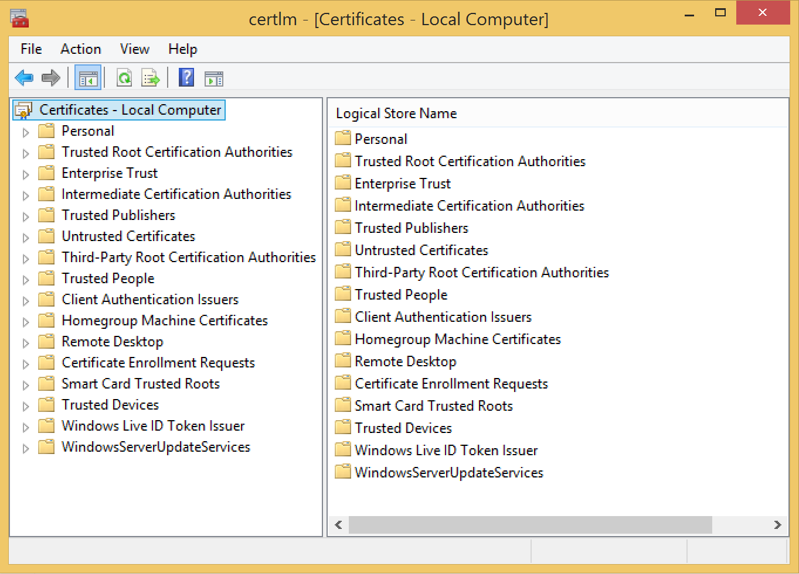
  

2)

  

3)
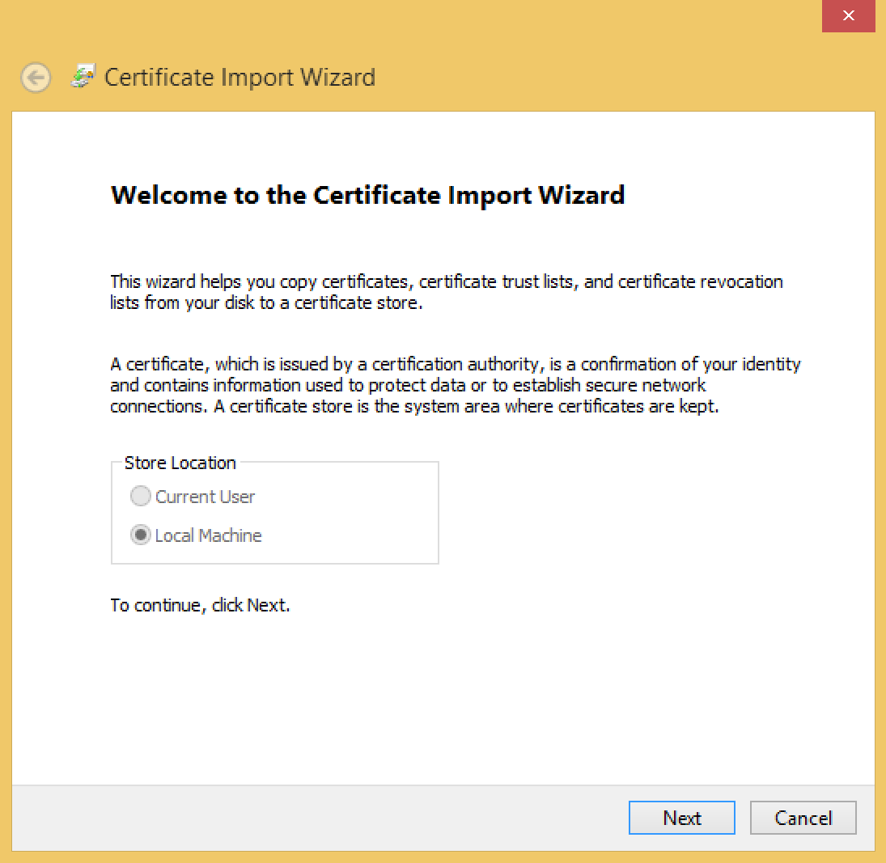
  

4)
Choose All Files(&ast;.&ast;) and select ca-cert.pem

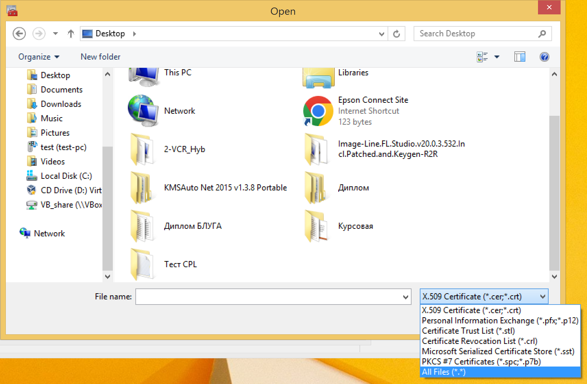
  

5)
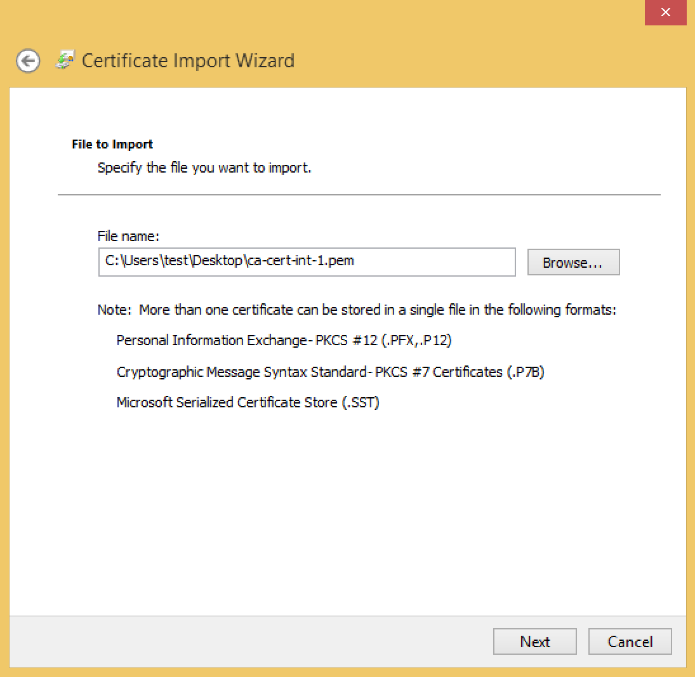
  

6)

  

7)
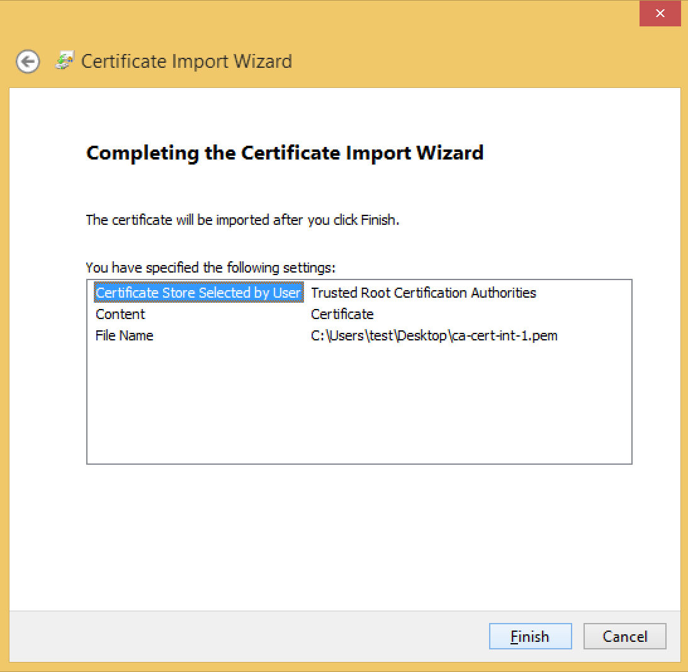 

After that you can create VPN connection in Windows Settings. 
VPN Type: IKEv2, Authenticate by Login/Password. (Tested on Windows 10, 11)
 

<b>3. iOS</b>

<h2>iOS</h2>

1) Download ca-cert.pem using Safari (it is important use Safari browser). Then go to
Settings and open "Profile Downloaded" and choose "Install".

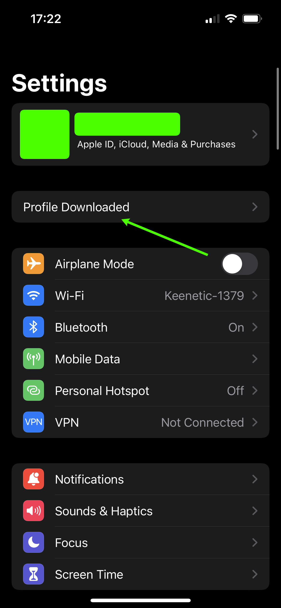
  
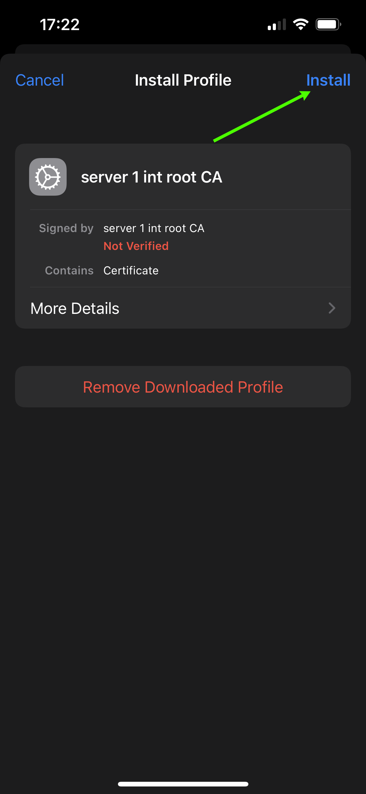
  
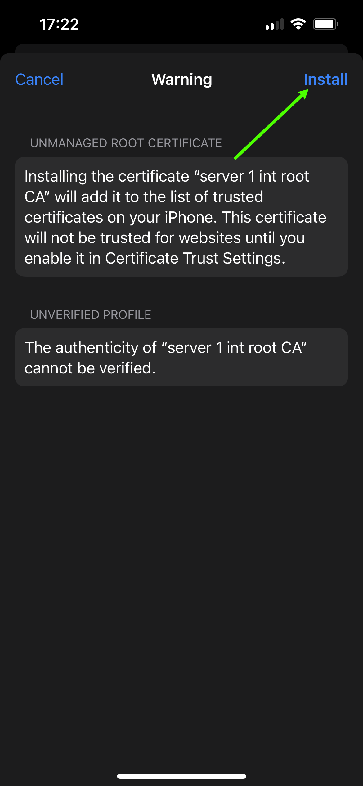
  

2) After that go to Settings <code>General -> VPN & Device Management -> VPN -> Add VPN Configuration</code> 

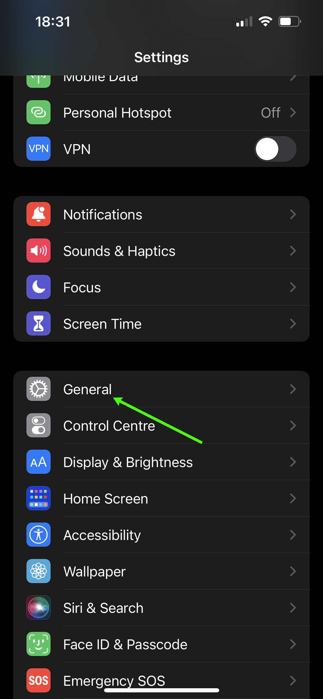
  
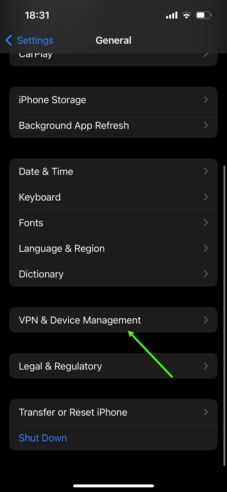
  

  
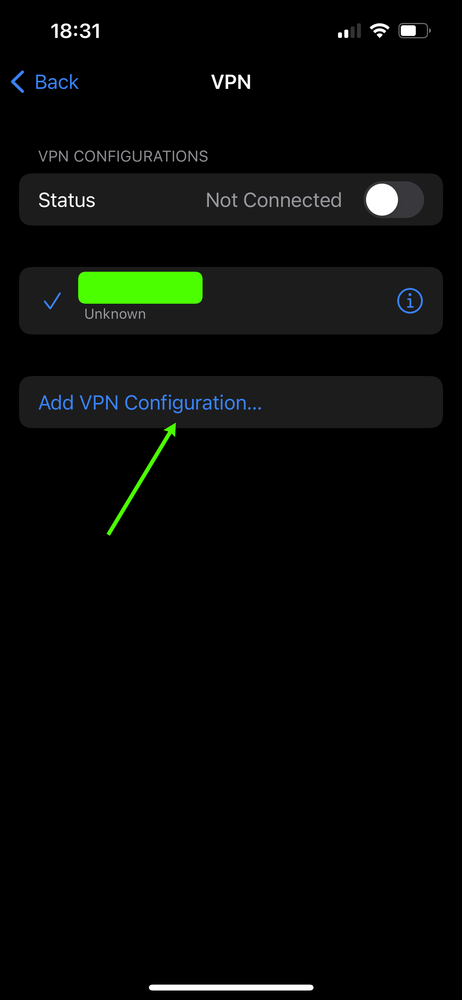
  

3) Fill in the fields.

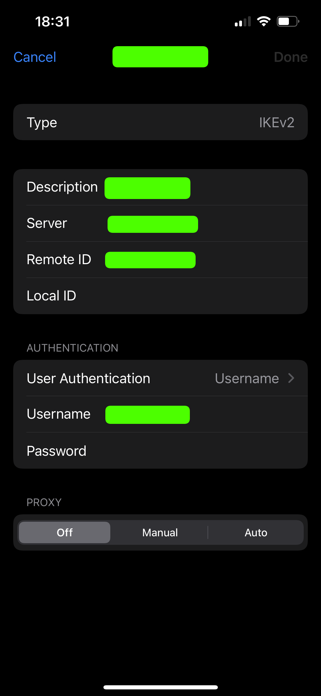
 
Type: IKEv2 
Server: your <code>server address</code> 
Remote ID: your <code>server address</code> 
User Authentication: <code>Username</code> 
Username: your <code>login</code> 
Password: your <code>password</code> 

<b>4. Android</b>

<h2>Android</h2>

You have 2 ways: 

1) Use official application from Play Market <code>strongSwan VPN Client</code>
2) Use Android settings and create VPN Connection.

<h3>The 1 way:</h3>

1) Install the application <code>strongSwan VPN Client</code>

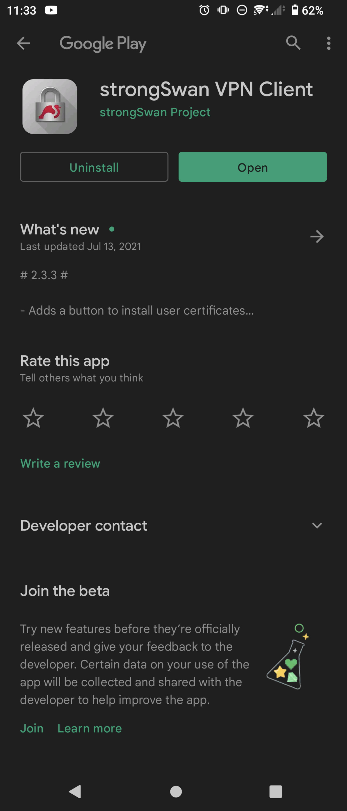
  

2)
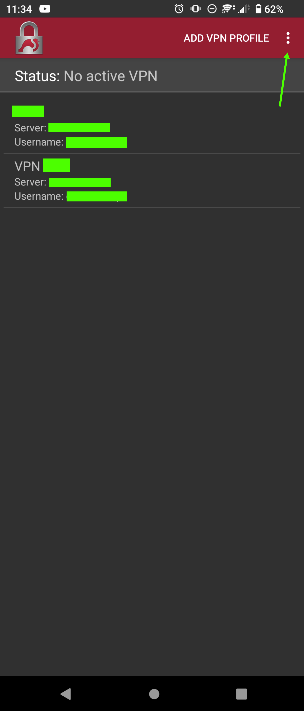
  

3)
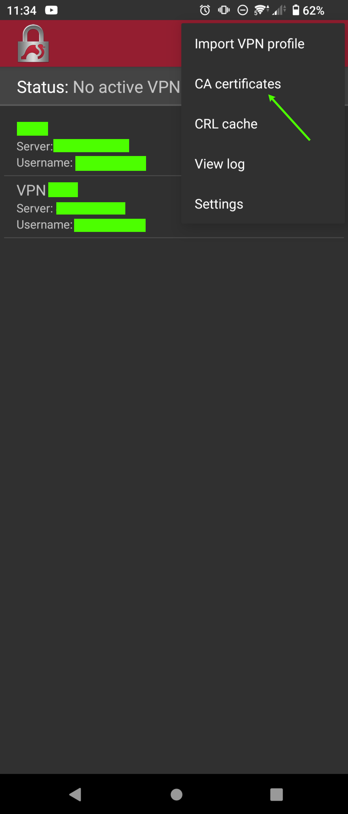
  

4)

  

5) Tap to Import certificate and choose ca-cert.pem file.

  

6) Go back to main screen and choose "ADD VPN PROFILE". Fill in the fields, uncheck <code>Select CA certificate</code>
and choose imported certificate. 

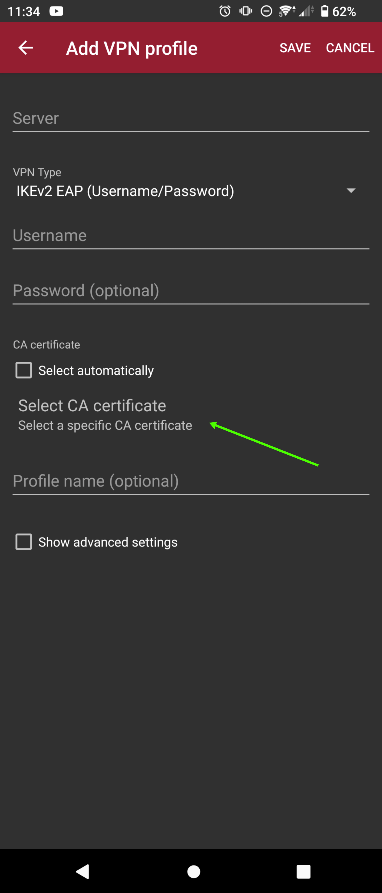
  

7) Sometimes the imported certificate is not displayed. In this case, go back
and open this menu again.

  

8) You can add VPN shortcut to Android top menu.

 

<h3>The 2 way:</h3>

1) Go to Android Settings, then  
<code>Security -> Encription & Credentials -> Install a certificate -> CA certificate</code> 
and install ca-cert.pem
2) Go to Network -> VPN and create VPN conecction profile. 
Type: IKEv2/IPSec MSCHAPv2 
Server address: your <code>server address</code> 
IPSec CA certificate - choose your imported certificate 
IPSec identifier: your <code>login</code> 
Username: your <code>login</code> 
Password: your <code>password</code> 

