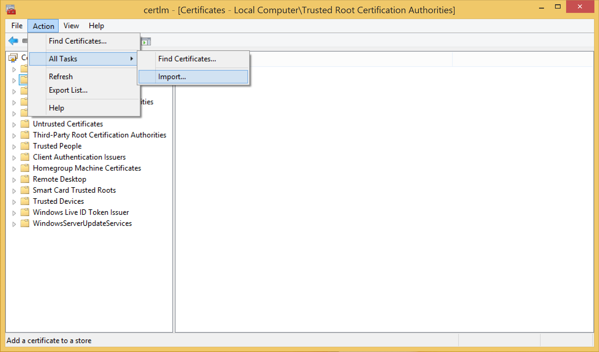
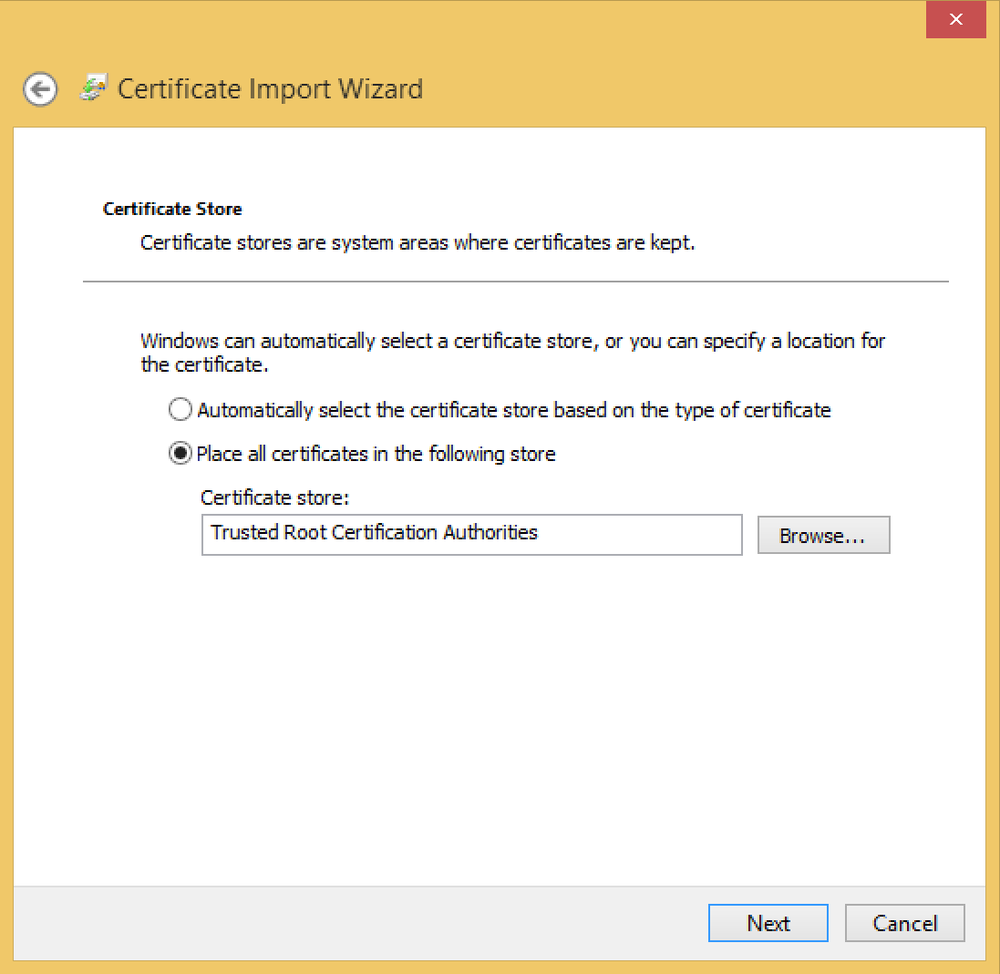
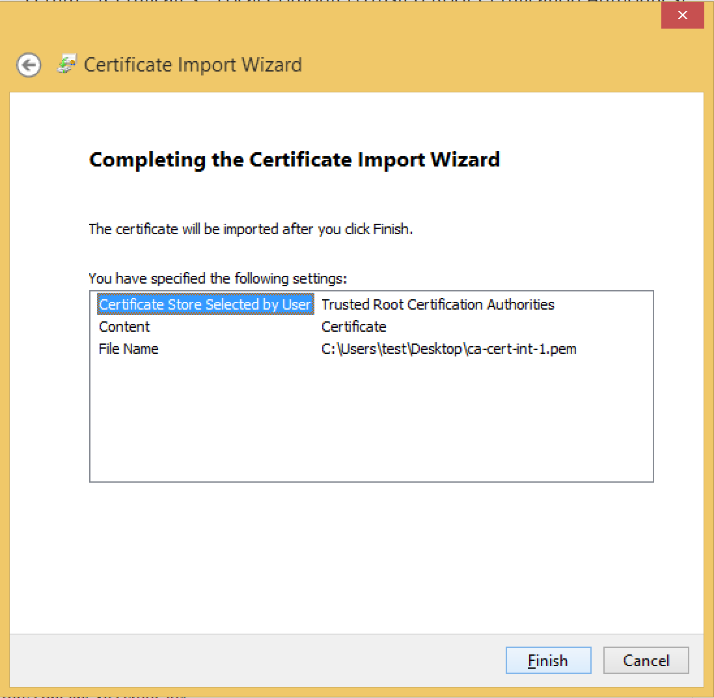
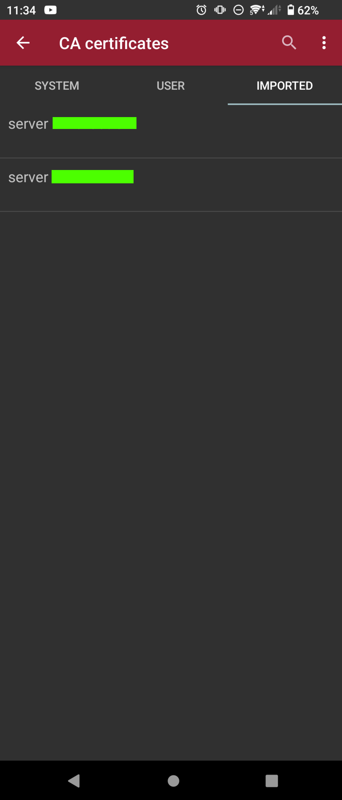
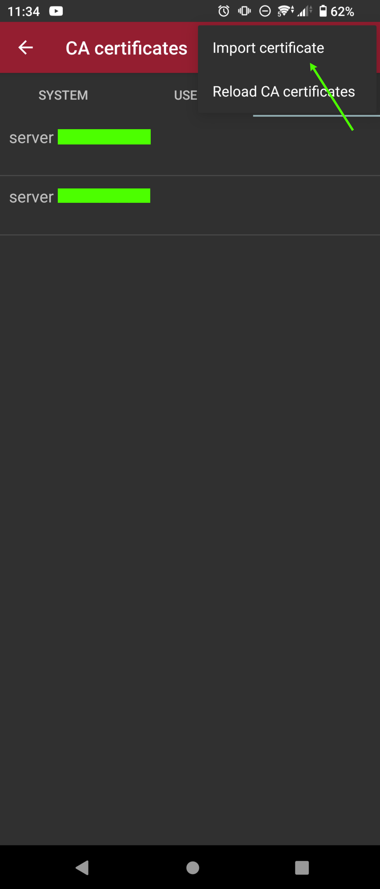
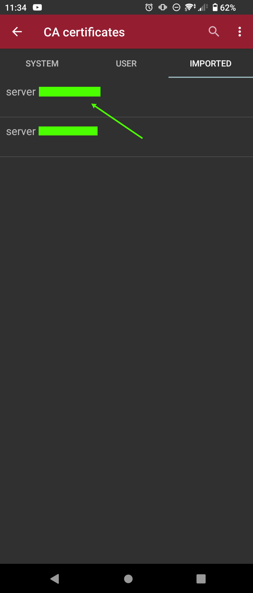
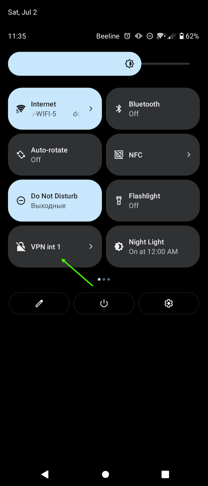

<h1><b>Server setup</b></h1>
This role tested on Ubuntu 20.04.

1) Change inventories, group_vars, host_vars values to your own 
2) Start playbook 

<code>ansible-playbook -i ./inventories/hosts ./strongswan.yml</code>

 
<b>Recommendations</b> 

1) If you need to recreate all certs, delete /etc/ipsec.d/private/ca-key.pem on remote host
and ansible role automaticaly will regenerate all necessary keys at the next start of role.

OR

run ansible-playbook with variable generate_certs=true

<code>ansible-playbook -i ./inventories/hosts ./strongswan.yml -e "generate_certs=true"</code>

2) When you add or edit user credentials, ipsec.service doesn't restart. It rereads the config. Works well in 90 percent
cases. You can write some symbols in username or password and strongswan may crash when try to read it.
In this case you need to change credentials and restart ipsec.service, run ansible-playbook with ipsec_restart=true

<code>ansible-playbook -i ./inventories/hosts ./strongswan.yml -e "ipsec_restart=true"</code>

<h1><b>Clients setup</b></h1>

<h2><b>Ubuntu or other Linux</b></h2>
Copy <code>/etc/ipsec.d/cacerts/ca-cert.pem</code> from remote host to local host 
<code>/etc/ipsec.d/cacerts/ca-cert.pem</code>

It is necessary that the key is located in this path /etc/ipsec.d/cacerts/ca-cert.pem on local mashine. 
Otherwise, the vpn client may not accept it.
Use any vpn client you want.

Auth method EAP 
Use ca-cert.pem and login/password for vpn client.

<h2><b>Windows</b></h2>
Open <code>Manage Computer Certificates</code>. 
Add ca-cert.pem to <code>Trusted Root Certification Authorities</code>.

By steps: 

1)

2)

3)

4)
Choose All Files(&ast;.&ast;)

5)

6)

7)

After that you can create VPN connection in Windows Settings. 
VPN Type: IKEv2, Authenticate by Login/Password. (Tested on Windows 11)

<h2><b>Android</b></h2>
You have 2 ways:
1) Use official application from Play Market <code>strongSwan VPN Client</code>
2) Use Android settings and create VPN Connection.

<h3>The 1 way:</h3>
1) Install the application <code>strongSwan VPN Client</code>

2)

3)

4)

5) Tap to Import certificate and choose ca-cert.pem file.

6) Uncheck <code>Select CA certificate</code> and choose imported certificate. 

7) Sometimes the imported certificate is not displayed. In this case, go back
and open this menu again.

8) You can add VPN shortcut to Android top menu.

<h3>The 2 way:</h3>

1) Go to Android Settings, then  
<code>Security -> Encription & Credentials -> Install a certificate -> CA certificate</code> 
and install ca-cert.pem
2) Go to Network -> VPN and create VPN conecction profile. 
Type: IKEv2/IPSec MSCHAPv2 
Server address: your <code>server address</code> 
IPSec CA certificate - choose your imported certificate 
IPSec identifier: your <code>login</code> 
Username: your <code>login</code> 
Password: your <code>password</code> 

<h2><b>iOS</b></h2>

1) Download ca-cert.pem using Safari (it is important use Safari browser).
System will write that you can import certificate. Do it.
2) After that go to Settings <code>General -> VPN -> Add VPN Configuration</code>
Type: IKEv2
Server: your <code>server address</code> 
Remote ID: your <code>server address</code> 
Local ID: your <code>login</code> 
User Authentication: <code>Username</code>
Username: your <code>login</code> 
Password: your <code>password</code> 